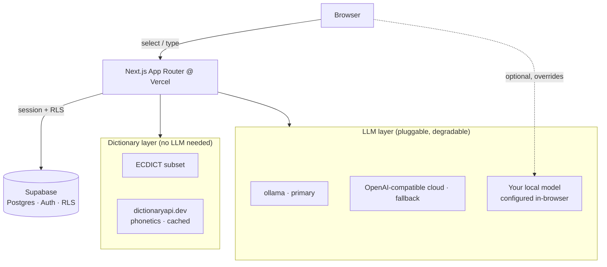
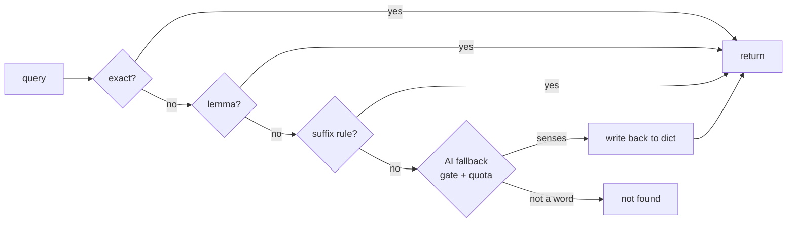

<div align="center">

# 📖 Translate · Wordbook

**A Chinese ↔ English translator that turns every lookup into a personal vocabulary book you can review.**

Look up a word or translate a paragraph, harvest the hard words, save them, and drill them with flashcards — all backed by a local dictionary that keeps working even when every AI backend is down.

[](https://nextjs.org)
[](https://react.dev)
[](https://supabase.com)
[](#-testing)
[](LICENSE)

English · [简体中文](README.zh-CN.md)

</div>

---

## ✨ Features

- **Two-way translation** — Chinese ↔ English, auto-detecting single words vs. paragraphs.
- **Rich word cards** — US/UK phonetics with audio, meanings grouped by part of speech, exam tags (CET / TOEFL / GRE …).
- **Adaptive hard-word extraction** — a paragraph is broken down into its hardest words; difficulty adapts to *your* wordbook (words you've mastered stop showing up).
- **In-context meaning** — click a hard word to ask the model what it means *in this sentence*.
- **Select-to-look-up** — highlight any English word anywhere to get an instant card.
- **AI fallback that sticks** — a word the dictionary doesn't have gets an AI-generated definition **written back into the dictionary**, so the next lookup is instant and free.
- **Personal wordbook** — save, search, remove; tracks familiarity and review count.
- **Flashcard review** — sequential or (seeded, reproducible) random order; keyboard-driven.
- **Bring your own model** — configure a local OpenAI-compatible endpoint in the browser; when set, it transparently overrides the server backend for translation, lookups, and explanations.
- **Multi-user with strict isolation** — Supabase Auth + Row Level Security; an email allowlist gates sign-up.

## 🧱 Architecture

The **dictionary layer** and the **LLM layer** are fully decoupled: if every translation backend is unavailable, word lookup, the wordbook, and review still work.



### Word lookup: a 5-level degrade chain



### Translation dispatch

A scheduler tries providers in priority order (`ollama` → `cloud`), with a **circuit breaker** and a **first-byte timeout** that downgrades a stalled backend without killing a healthy but slow one. If the user has configured a local model, the browser calls it directly and skips the server entirely.

## 🛠 Tech Stack

| Layer | Choice |
|---|---|
| Framework | Next.js 16 (App Router, Turbopack), React 19 |
| Styling | Tailwind CSS v4 (`@theme inline`, no config file) |
| Data / Auth | Supabase — Postgres, Auth, Row Level Security, `service_role` |
| Dictionary | ECDICT high-frequency subset + dictionaryapi.dev (cached) |
| Translation | ollama (primary) + any OpenAI-compatible endpoint (fallback) |
| Unit tests | Vitest (tests colocated with source) |
| E2E | Playwright |
| Hosting | Vercel |

## 🚀 Quick Start

```bash
npm install
cp .env.local.example .env.local     # fill in the values below
npx supabase db push                 # apply DB migrations
npm run import:ecdict                # import the dictionary (needs data/stardict.csv)
npm run dev                          # http://localhost:3000
```

### Environment variables

| Variable | Purpose |
|---|---|
| `NEXT_PUBLIC_SUPABASE_URL` / `NEXT_PUBLIC_SUPABASE_ANON_KEY` | Supabase client |
| `SUPABASE_SERVICE_ROLE_KEY` | Server-side writes (dict cache, AI entries, quota) |
| `OLLAMA_BASE_URL` / `OLLAMA_TOKEN` / `OLLAMA_MODEL` | Primary translation backend (optional) |
| `CLOUD_BASE_URL` / `CLOUD_API_KEY` / `CLOUD_MODEL` | OpenAI-compatible fallback |
| `DAILY_QUOTA` | Per-user daily LLM budget (default 200) |
| `ALLOWED_EMAILS` | Comma-separated sign-up/sign-in allowlist (empty = unrestricted) |
| `E2E_EMAIL` / `E2E_PASSWORD` | Local Playwright account (never set in production) |

### Using your own local model (no code, no redeploy)

Open **Settings** in the app, fill in a Base URL (e.g. `http://localhost:11434/v1`), a model name, and optionally a custom prompt. It's stored in `localStorage` and only speaks the OpenAI protocol. Once set, translation / lookup-fallback / explanation all run through it.

> On the HTTPS site, browsers block direct calls to `http://localhost` (mixed content). Expose your model over HTTPS via a tunnel (`cloudflared tunnel --url http://localhost:11434`) or allow the site's origin (`OLLAMA_ORIGINS=https://your.site ollama serve`). No such limit in local `http` dev.

## 🧪 Testing

```bash
npm test           # 276 unit tests (Vitest)
npm run test:e2e   # 6 end-to-end tests (Playwright) — needs a translation backend
                   # and E2E_EMAIL / E2E_PASSWORD in .env.local
npm run build      # authoritative typecheck + production build
```

> Use `npm run build` for typechecking, **not** bare `tsc --noEmit` — some route types are generated into `.next/types` at build time.

## 📁 Project Structure

```
src/
  app/                 # App Router pages + API routes
    api/               # word, translate, hard-words, explain, wordbook, review, ai-entry, auth
    page.tsx           # translate + lookup entry
    wordbook/ review/ settings/ login/
  components/          # WordCard, HardWordGrid, SelectionPopover, TranslateResult, NavBar, ...
  lib/
    dict/              # lookup chain, ai fallback, phonetics, client lookup
    translate/         # providers, scheduler, circuit breaker, prompts, local model
    hardwords/         # tokenize, score, extract
    review/            # ordering (seeded PRNG) + familiarity rules
    supabase/ text/ audio/ quota.ts
  proxy.ts             # session gate + email allowlist (Next 16 middleware)
supabase/migrations/   # schema + RLS
docs/                  # design specs, plans, engineering notes
```

## 🗺 Roadmap / Not (yet) implemented

Deliberately out of scope for now: SM-2 spaced repetition (DB columns reserved), translation history, guest mode, language pairs beyond zh↔en, cross-device preference sync.

## 📚 Docs

- **[Engineering Notes](docs/engineering-notes.md)** — architecture decisions, conventions, and every pitfall we hit (read this before your second pass).
- Design specs: `docs/superpowers/specs/`
- Implementation plans: `docs/superpowers/plans/`
- Infrastructure: `docs/infra/hardening.md`

## 📄 License

MIT — see [LICENSE](LICENSE).
