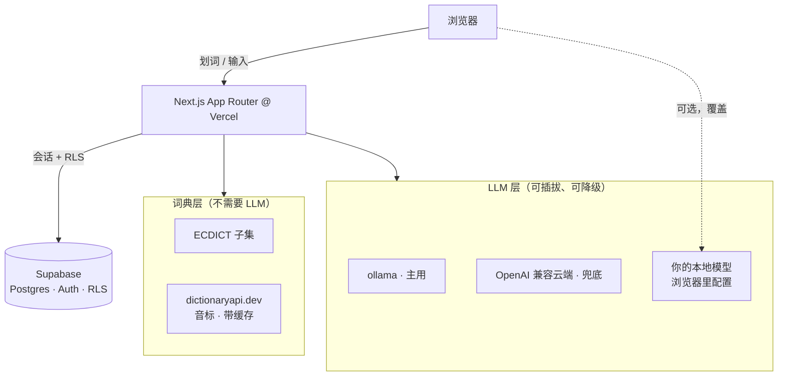
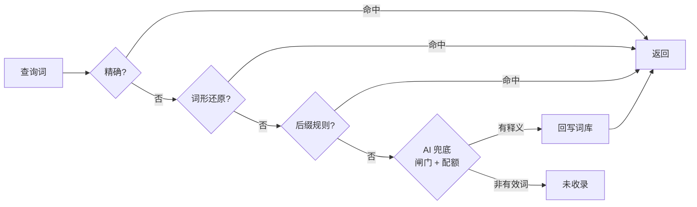

<div align="center">

# 📖 翻译 · 单词本

**把每一次查词都沉淀成可复习的个人单词本的中英互译工具。**

查单词、译段落、拆出难词、收藏、翻卡复习 —— 底层是一套即使所有 AI 后端全挂也照常工作的本地词典。

[](https://nextjs.org)
[](https://react.dev)
[](https://supabase.com)
[](#-测试)
[](LICENSE)

[English](README.md) · 简体中文

</div>

---

## ✨ 功能

- **双向翻译** —— 中↔英，自动识别单词与段落。
- **完整词卡** —— 美/英音标带发音、按词性分组的中文释义、考试标签（CET / TOEFL / GRE …）。
- **自适应难词拆解** —— 段落自动拆出最难的词；难度随**你自己**的单词本变化（已掌握的词不再出现）。
- **上下文释义** —— 点难词，问模型「它在这句话里是什么意思」。
- **划词即查** —— 选中任意英文词，立刻弹出词卡。
- **会「收录」的 AI 兜底** —— 词库没有的词，AI 生成释义并**写回词库**，下次查它即时命中、不再花钱。
- **个人单词本** —— 收藏、搜索、移除；记录熟练度与复习次数。
- **翻卡复习** —— 顺序或（带种子、可复现的）随机；支持键盘操作。
- **自带模型** —— 在浏览器里配置一个 OpenAI 兼容的本地端点；配了就透明覆盖服务端后端（翻译 / 查词兜底 / 释义都走它）。
- **多用户强隔离** —— Supabase Auth + 行级安全（RLS）；邮箱白名单控制注册。

## 🧱 架构

**词典层**与 **LLM 层**完全解耦：所有翻译后端都不可用时，查词、单词本、复习照常工作。



### 查词：五级降级链



### 翻译调度

调度器按优先级（`ollama` → `cloud`）依次尝试，带**熔断器**与**首字节超时**：卡死的后端会被降级，而健康但较慢的后端不会被误杀。若用户配置了本地模型，浏览器直连它、完全绕过服务端。

## 🛠 技术栈

| 层 | 选型 |
|---|---|
| 框架 | Next.js 16（App Router、Turbopack）、React 19 |
| 样式 | Tailwind CSS v4（`@theme inline`，无配置文件） |
| 数据 / 认证 | Supabase —— Postgres、Auth、行级安全、`service_role` |
| 词典 | ECDICT 高频子集 + dictionaryapi.dev（带缓存） |
| 翻译 | ollama（主用）+ 任意 OpenAI 兼容端点（兜底） |
| 单元测试 | Vitest（测试与源码同目录） |
| 端到端 | Playwright |
| 托管 | Vercel |

## 🚀 快速开始

```bash
npm install
cp .env.local.example .env.local     # 填入下方变量
npx supabase db push                 # 应用数据库迁移
npm run import:ecdict                # 导入词典（需先准备 data/stardict.csv）
npm run dev                          # http://localhost:3000
```

### 环境变量

| 变量 | 用途 |
|---|---|
| `NEXT_PUBLIC_SUPABASE_URL` / `NEXT_PUBLIC_SUPABASE_ANON_KEY` | Supabase 客户端 |
| `SUPABASE_SERVICE_ROLE_KEY` | 服务端写入（音标缓存、AI 词条、配额） |
| `OLLAMA_BASE_URL` / `OLLAMA_TOKEN` / `OLLAMA_MODEL` | 主用翻译后端（可选） |
| `CLOUD_BASE_URL` / `CLOUD_API_KEY` / `CLOUD_MODEL` | OpenAI 兼容兜底 |
| `DAILY_QUOTA` | 每用户每日 LLM 配额（默认 200） |
| `ALLOWED_EMAILS` | 逗号分隔的注册/登录白名单（留空 = 不限制） |
| `E2E_EMAIL` / `E2E_PASSWORD` | 本地 Playwright 账号（生产禁配） |

### 使用你自己的本地模型（无需改代码、无需重新部署）

打开应用里的**设置**页，填 Base URL（如 `http://localhost:11434/v1`）、模型名，可选自定义提示词。配置存 `localStorage`，只兼容 OpenAI 协议。配好后，翻译 / 查词兜底 / 释义都会走它。

> 线上是 HTTPS 页面，浏览器会拦截它直连 `http://localhost`（混合内容）。用隧道把模型暴露成 HTTPS（`cloudflared tunnel --url http://localhost:11434`），或让端点放行本站来源（`OLLAMA_ORIGINS=https://你的域名 ollama serve`）。本机 `http` 开发环境无此限制。

## 🧪 测试

```bash
npm test           # 276 个单元测试（Vitest）
npm run test:e2e   # 6 个端到端测试（Playwright）—— 需翻译后端可用，
                   # 并在 .env.local 配置 E2E_EMAIL / E2E_PASSWORD
npm run build      # 权威类型检查 + 生产构建
```

> 类型检查用 `npm run build`，**不要**用裸 `tsc --noEmit` —— 部分路由类型是构建时生成到 `.next/types` 的。

## 📁 项目结构

```
src/
  app/                 # App Router 页面 + API 路由
    api/               # word、translate、hard-words、explain、wordbook、review、ai-entry、auth
    page.tsx           # 翻译 + 查词入口
    wordbook/ review/ settings/ login/
  components/          # WordCard、HardWordGrid、SelectionPopover、TranslateResult、NavBar 等
  lib/
    dict/              # 查词链路、AI 兜底、音标、客户端查词
    translate/         # provider、调度器、熔断器、prompt、本地模型
    hardwords/         # 分词、打分、提取
    review/            # 排序（带种子 PRNG）+ 熟练度规则
    supabase/ text/ audio/ quota.ts
  proxy.ts             # 会话拦截 + 邮箱白名单（Next 16 中间件）
supabase/migrations/   # schema + RLS
docs/                  # 设计规范、计划、工程笔记
```

## 🗺 路线图 / 暂未实现

当前刻意排除：SM-2 间隔重复（数据库字段已预留）、翻译历史、游客模式、中英之外的语言对、跨设备偏好同步。

## 📚 文档

- **[工程笔记](docs/engineering-notes.md)** —— 架构决策、规范、以及我们踩过的每一个坑（二次开发前务必先读）。
- 设计规范：`docs/superpowers/specs/`
- 实施计划：`docs/superpowers/plans/`
- 基础设施：`docs/infra/hardening.md`

## 📄 许可证

MIT，见 [LICENSE](LICENSE)。
